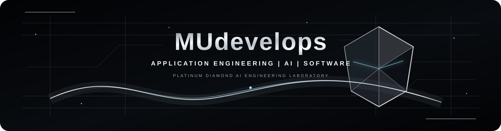

<div align="center">



<br>


<br><br>

<a href="https://github.com/MUdevelops">

</a>
&nbsp;
<a href="https://m-umar-jamal.netlify.app/">

</a>
&nbsp;
<a href="https://github.com/MUdevelops?tab=repositories">

</a>

<br><br>


</div>

---

<div align="center">

### ◇ SYSTEM 00 / PROFILE IDENTITY

# MUDEVELOPS

**APPLICATION ENGINEERING  ·  AI  ·  SOFTWARE**

`AI APPLICATION ENGINEER` &nbsp; `SOFTWARE DEVELOPER` &nbsp; `APPLICATION BUILDER`


> **From idea → architecture → code → AI → API → interface → deployment.**

</div>

---

## ◇ 01 / APPLICATION ENGINEERING

I am focused on **Application Engineering** — designing and building complete software systems rather than working only on isolated code or models.

My current direction combines:

| **AI APPLICATIONS** | **APPLICATION DEVELOPMENT** | **INTELLIGENT SYSTEMS** | **ENGINEERING** |
| :---: | :---: | :---: | :---: |
| LLM Applications | React / TypeScript | Computer Vision | Databases |
| RAG Systems | Python / FastAPI | Document Intelligence | Authentication |
| AI Agents | REST APIs | AI Assistants | Docker |
| Intelligent Automation | Full-Stack Systems | Automation | Testing |
|  |  |  | CI/CD |

### ◈ ENGINEERING PHILOSOPHY

> **Don't just build models. Build applications around them.**  
> **Don't just write code. Build systems that solve problems.**

---

## ◇ 02 / WHAT I BUILD

<div align="center">

| ◇ **AI APPLICATIONS** | ◇ **APPLICATIONS** | ◇ **ENGINEERING** |
| :--- | :--- | :--- |
| LLM Applications | Full-Stack Apps | REST APIs |
| RAG Systems | Web Applications | Authentication |
| AI Assistants | Android Apps | Databases |
| AI Agents | Real-Time Systems | Docker |
| Computer Vision | Developer Tools | Testing |
| Intelligent Automation | Productivity Apps | CI/CD |

<br>

`DESIGN` → `DEVELOP` → `INTEGRATE` → `TEST` → `DEPLOY`

</div>

---

## ◇ 03 / AI APPLICATION ENGINEERING

### ◈ SYSTEM CAPABILITIES

| Area | Focus |
| :--- | :--- |
| **LLM Applications** | AI-powered features, assistants & intelligent workflows |
| **RAG** | Document retrieval, embeddings, semantic search & citations |
| **AI Agents** | Tool calling, workflows & autonomous task execution |
| **Computer Vision** | Face recognition, image analysis & intelligent detection |
| **Document AI** | PDF/DOCX processing, knowledge extraction & Q&A |
| **Voice AI** | Speech interfaces & conversational applications |
| **AI Automation** | AI-powered productivity & workflow automation |
| **Local AI** | Local LLMs, privacy-focused AI & offline inference |

### ◈ AI APPLICATION ARCHITECTURE

```text
                         ◇ USER
                           │
                           ▼
               ┌───────────────────────┐
               │       FRONTEND        │
               │ React / Web Interface │
               └───────────┬───────────┘
                           │
                           ▼
               ┌───────────────────────┐
               │       API LAYER       │
               │ FastAPI / REST / Auth │
               └───────────┬───────────┘
                           │
                     ◇─────┴─────◇
                     │           │
                     ▼           ▼
             ┌────────────┐ ┌────────────┐
             │ AI ENGINE  │ │  DATABASE  │
             │ LLM / RAG  │ │ SQL /      │
             │ Agents     │ │ Vector DB  │
             └──────┬─────┘ └────────────┘
                    │
                    ▼
             ┌────────────────┐
             │ AI RESPONSE /  │
             │     ACTION     │
             └────────────────┘
```

---

## ◇ 04 / ENGINEERING STACK

### LANGUAGES

`Python` `C++` `C` `Kotlin` `Java` `JavaScript` `TypeScript` `HTML` `CSS` `Bash`

### AI / MACHINE LEARNING

`PyTorch` `TensorFlow`  
`LLMs` · `RAG` · `Embeddings` · `Vector Search` · `AI Agents` · `Computer Vision` · `Prompt Engineering` · `Local AI`

### APPLICATION DEVELOPMENT

`React` `Node.js` `FastAPI` `Vite` `Tailwind` `Android Studio`

### DATA & INFRASTRUCTURE

`PostgreSQL` `MongoDB` `SQLite` `Docker` `Linux`

### DEVELOPER TOOLS

`Git` `GitHub` `VS Code` `Postman`

> **STACK SIGNAL**  —  Python · FastAPI · React · TypeScript · LLMs · RAG · Agents · Vector Databases · Docker · PostgreSQL · GitHub Actions

---

## ◇ 05 / FEATURED AI APPLICATIONS

### ◇ 01  ·  DOCUMIND AI
**Your documents. Your infrastructure. Your AI.**

Local-first AI document intelligence and RAG platform for uploading documents, retrieving knowledge, and asking AI-powered questions with contextual answers.

`Python` `FastAPI` `React` `TypeScript` `Ollama` `ChromaDB` `PostgreSQL`

---

### ◇ 02  ·  INTERVUAI
**AI-powered interview intelligence.**

An application focused on using AI to create interactive interview experiences, analyze responses, and provide intelligent feedback.

`AI` `LLM` `Application Engineering` `Web`

---

### ◇ 03  ·  MARCUS PC ASSISTANT
**An intelligent desktop assistant.**

AI-powered desktop automation combining natural interaction with practical system-level functionality.

`Python` `AI` `Automation` `Desktop`

---

### ◇ 04  ·  FINDRAW-AI
**AI-powered intelligent drawing & shape recognition.**

An intelligent drawing application capable of recognizing shapes and transforming user interaction into machine-understandable structures.

`Python` `AI` `Computer Vision`

---

### ◇ 05  ·  GEONIZAM
**AI-powered workforce management.**

A real-world employee management system combining attendance, face recognition, GPS tracking and intelligent verification.

`Python` `AI` `Face Recognition` `GPS` `Real-Time Systems`

<div align="center">

<a href="https://github.com/MUdevelops?tab=repositories">

</a>

</div>

---

## ◇ 06 / HOW I BUILD

```text
◇ 01  IDEA
      │
      ▼
◇ 02  PROBLEM UNDERSTANDING
      │
      ▼
◇ 03  ARCHITECTURE
      │
      ▼
◇ 04  IMPLEMENTATION
      ├───────────────┐
      ▼               ▼
   ◇ AI            ◇ APP
      └───────┬───────┘
              ▼
◇ 05  INTEGRATION
      │
      ▼
◇ 06  TESTING
      │
      ▼
◇ 07  DOCKER / CONTAINERIZATION
      │
      ▼
◇ 08  DEPLOY
      │
      ▼
◇ 09  IMPROVE
```

<div align="center">

**BUILD → INTEGRATE → TEST → DEPLOY → IMPROVE**

</div>

---

## ◇ 07 / CURRENT RESEARCH

<div align="center">

`ACTIVE EXPLORATION`

</div>

| Research Area | Current Direction |
| :--- | :--- |
| **AI Application Engineering** | Building complete intelligent applications |
| **Large Language Model Applications** | Product-focused LLM integration |
| **Retrieval-Augmented Generation** | Grounded knowledge systems |
| **AI Agents & Tool Calling** | Workflow-oriented agent systems |
| **Full-Stack AI Systems** | AI + backend + frontend integration |
| **Local & Private AI** | Local models, privacy & offline inference |
| **Production-Ready Software** | Reliability, testing & deployment |
| **Developer Automation** | AI-assisted engineering workflows |

---

## ◇ 08 / ENGINEERING PRINCIPLES

| ◇ Principle | Meaning |
| :--- | :--- |
| **Solve Problems** | Technology should serve a real problem |
| **Build Systems** | Think beyond isolated features |
| **Use AI Intentionally** | AI should improve the application |
| **Test** | Working software needs verification |
| **Build Securely** | Protect users, data and credentials |
| **Keep It Maintainable** | Clean structure beats unnecessary complexity |
| **Ship** | A finished application creates more value than an unfinished idea |
| **Keep Improving** | Every project is an opportunity to learn |

<div align="center">

> **“Don't just consume technology. Build with it.”**

</div>

---

## ◇ 09 / CONTRIBUTION ACTIVITY

<div align="center">


<br><br>

`CONSISTENCY` · `ITERATION` · `SHIPPING`

</div>

---

## ◇ 10 / OPEN TO OPPORTUNITIES

<div align="center">

| ◇ | ◇ | ◇ |
| :---: | :---: | :---: |
| **AI APPLICATION ENGINEERING** | **SOFTWARE ENGINEERING** | **FULL-STACK DEVELOPMENT** |
| AI / ML Applications | Automation | Freelance Projects |

</div>

---

## ◇ 11 / CONNECT WITH ME

<div align="center">

<a href="https://m-umar-jamal.netlify.app/">

</a>
&nbsp;&nbsp;
<a href="https://github.com/MUdevelops">

</a>
&nbsp;&nbsp;
<a href="https://github.com/MUdevelops?tab=repositories">

</a>

</div>

---

<div align="center">


<br><br>

### ◇ BUILD  ·  INTEGRATE  ·  TEST  ·  SHIP

**APPLICATION ENGINEERING  |  AI  |  SOFTWARE**

Thanks for visiting **MUdevelops**.

<br>


</div>
